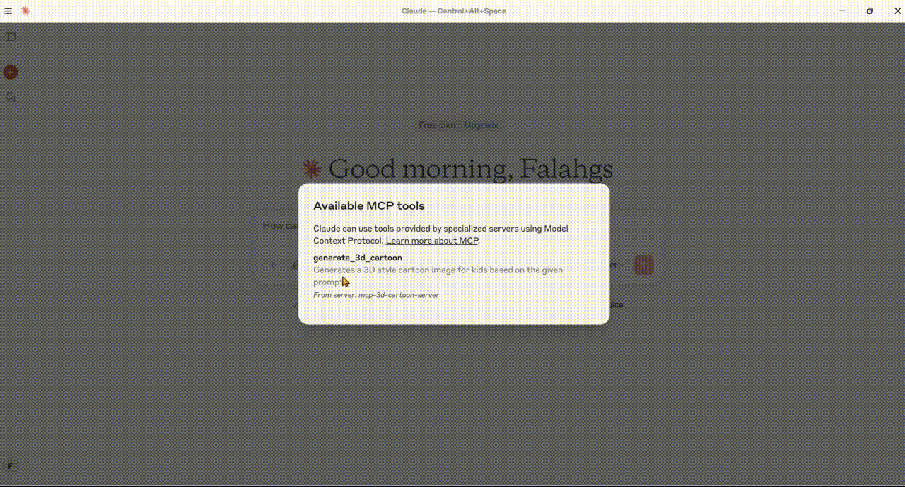

# MCP 3D Cartoon Generator

[](https://smithery.ai/server/@falahgs/mcp-3d-style-cartoon-gen-server)
A professional-grade server for generating high-quality 3D-style cartoon images using Google's Gemini AI. This tool specializes in creating child-friendly, colorful, and engaging cartoon images from text prompts.



## 🌟 Features

- **3D Cartoon Generation**: Creates high-quality 3D-style cartoon images
- **Child-Friendly Design**: Focuses on colorful, playful, and engaging visuals
- **Instant Preview**: Automatically opens generated images in your default browser
- **Local Storage**: Saves images and previews in an organized output directory
- **Professional Configuration**: Robust error handling and logging

## 🛠️ Technical Stack

- **Core Framework**: Model Context Protocol (MCP) SDK
- **AI Integration**: Google Generative AI (Gemini Pro Vision)
- **Runtime**: Node.js v14+
- **Language**: TypeScript
- **Package Manager**: npm

## 📋 Prerequisites

- Node.js (v14 or higher)
- Google Gemini API key
- TypeScript

## ⚙️ Installation

### Installing via Smithery

To install 3D Cartoon Generator Server for Claude Desktop automatically via [Smithery](https://smithery.ai/server/@falahgs/mcp-3d-style-cartoon-gen-server):

```bash
npx -y @smithery/cli install @falahgs/mcp-3d-style-cartoon-gen-server --client claude
```

### Manual Installation
1. Clone the repository:
```bash
git clone https://github.com/falahgs/mcp_3d_cartoon_generator.git
cd mcp_3d_cartoon_generator
```

2. Install dependencies:
```bash
npm install
```

3. Configure environment:
Create a `.env` file in the root directory:
```env
GEMINI_API_KEY=your_api_key_here
```

## 🔧 Configuring Claude Desktop with MCP Server

To integrate the MCP 3D Cartoon Generator with Claude Desktop:

1. Locate the Configuration File:
   - Windows: `%APPDATA%\Claude\claude_desktop_config.json`
   - macOS: `~/Library/Application Support/Claude/claude_desktop_config.json`
   - Linux: `~/.config/Claude/claude_desktop_config.json`

2. Edit the Configuration:
   Open the `claude_desktop_config.json` file in a text editor and add the following configuration:

```json
{
  "mcpServers": {
    "mcp-3d-cartoon-server": {
      "command": "node",
      "args": [
        "G:\\mcp-projects\\mcp-3d-style-cartoon-gen-server\\build\\index.js" 
      ],
      "env": {
        "GEMINI_API_KEY": "your_gemini_api_key_here",
        "IS_REMOTE": "true"
      }
    }
  }
}
```

Note: Replace the path in `args` with the actual path to your cloned repository's `build/index.js` file.

## 🚀 Usage

### Tool Configuration

The server provides a single tool for 3D cartoon image generation:

```typescript
{
  "name": "generate_3d_cartoon",
  "description": "Generates a 3D style cartoon image for kids based on the given prompt",
  "inputSchema": {
    "type": "object",
    "properties": {
      "prompt": {
        "type": "string",
        "description": "The prompt describing the 3D cartoon image to generate"
      },
      "fileName": {
        "type": "string",
        "description": "The name of the output file (without extension)"
      }
    },
    "required": ["prompt", "fileName"]
  }
}
```

### Example Usage

1. Generate an image:
```typescript
{
  "name": "generate_3d_cartoon",
  "arguments": {
    "prompt": "A friendly robot playing with a cat",
    "fileName": "robot_cat_play"
  }
}
```

2. The tool will:
   - Generate the image using Gemini AI
   - Save it as a PNG file in the `output` directory
   - Create an HTML preview
   - Open the preview in your default browser
   - Return both the image path and preview

### Example Prompts

- "A group of happy animals having a picnic in a magical forest"
- "A young astronaut exploring a colorful alien planet"
- "A magical fairy teaching baby dragons to fly"
- "A friendly robot helping children build a treehouse"

## 📁 Output Structure

```
output/
├── image_name.png          # Generated image
└── image_name_preview.html # HTML preview
```

## 🔒 Security Notes

- Keep your API keys secure and never commit them to version control
- Use environment variables for sensitive configuration
- Run the server in a secure environment

## 📄 License

[Your chosen license]

## 🤝 Contributing

Contributions are welcome! Please feel free to submit a Pull Request. 